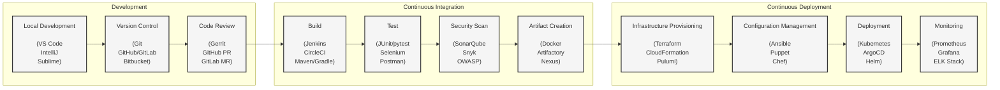

```mermaid
flowchart LR
    subgraph "Development"
        direction LR
        A["Local Development<br/><br/>(VS Code<br/>IntelliJ<br/>Sublime)"] --> 
        B["Version Control<br/><br/>(Git<br/>GitHub/GitLab<br/>Bitbucket)"] --> 
        C["Code Review<br/><br/>(Gerrit<br/>GitHub PR<br/>GitLab MR)"]
    end

    subgraph "Continuous Integration"
        direction LR
        D["Build<br/><br/>(Jenkins<br/>CircleCI<br/>Maven/Gradle)"] --> 
        E["Test<br/><br/>(JUnit/pytest<br/>Selenium<br/>Postman)"] --> 
        F["Security Scan<br/><br/>(SonarQube<br/>Snyk<br/>OWASP)"] -->
        G["Artifact Creation<br/><br/>(Docker<br/>Artifactory<br/>Nexus)"]
    end

    subgraph "Continuous Deployment"
        direction LR
        H["Infrastructure Provisioning<br/><br/>(Terraform<br/>CloudFormation<br/>Pulumi)"] --> 
        I["Configuration Management<br/><br/>(Ansible<br/>Puppet<br/>Chef)"] --> 
        J["Deployment<br/><br/>(Kubernetes<br/>ArgoCD<br/>Helm)"] --> 
        K["Monitoring<br/><br/>(Prometheus<br/>Grafana<br/>ELK Stack)"]
    end

    %% Connect the main sections
    C --> D
    G --> H

    classDef default fill:#f5f5f5,stroke:#333,stroke-width:2px
    classDef section fill:#e5f5e0,stroke:#3182bd,stroke-width:2px
```